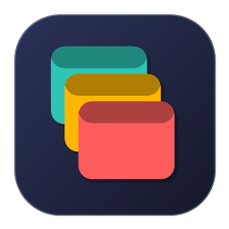
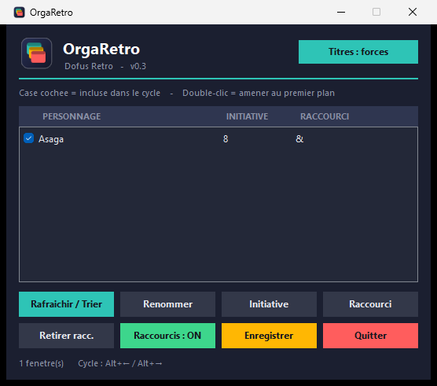

# OrgaRetro

**Gestionnaire multi-fenêtres pour Dofus Retro**
Navigue et organise tes fenêtres multi-comptes en un clin d'œil.

---

## ✨ Fonctionnalités

- 🔍 **Détection automatique** des fenêtres Dofus Retro
- 🔃 **Tri par initiative** — l'ordre du cycle suit l'initiative de tes personnages
- ⌨️ **Cycle précédent / suivant** entre les fenêtres (raccourcis globaux)
- 🎯 **Raccourci direct par personnage** avec **capture automatique de la touche**
- ✅ **Activation/désactivation** de chaque fenêtre dans le cycle (case à cocher)
- 🟢 **Bouton ON/OFF global** pour couper tous les raccourcis d'un coup
- 🏷️ **Forçage des titres** : renomme les fenêtres avec le nom du personnage
  (pour les différencier dans la barre des tâches / Alt+Tab)
- 💾 Sauvegarde de la configuration
- 🖱️ Icône dans la barre système (tray)

## 📥 Installation

1. Télécharge **`OrgaRetro.exe`** (voir l'onglet *Releases* ou le fichier ci-dessus).
2. Double-clique dessus. **Aucune installation requise** — c'est un programme autonome.

> ⚠️ Windows SmartScreen peut afficher un avertissement car l'exe n'est pas signé.
> Clique sur *Informations complémentaires → Exécuter quand même*.

## 🚀 Utilisation

1. Ouvre tes fenêtres Dofus Retro.
2. Clique sur **Rafraîchir / Trier**.
3. Pour chaque personnage :
   - **Renommer** — donne-lui un nom lisible
   - **Initiative** — la liste se trie automatiquement (la plus haute en premier)
   - **Raccourci** — clique le bouton puis **appuie sur la touche** (détection auto)
   - **Case cochée** — incluse dans le cycle
4. **Double-clic** sur une ligne = amener cette fenêtre au premier plan.
5. **Enregistrer** pour conserver ta configuration.

### Raccourcis par défaut

| Action | Touche |
|--------|--------|
| Fenêtre précédente | `Alt + ←` |
| Fenêtre suivante | `Alt + →` |

Le bouton **Raccourcis : ON/OFF** coupe ou réactive tous les raccourcis (pratique
pour taper normalement en jeu).

Le bouton **Titres : libres / forcés** (en haut à droite) renomme les fenêtres
avec le nom de chaque personnage, pour les reconnaître facilement.

## ⚖️ Avertissement

OrgaRetro est un simple outil de **navigation entre fenêtres** : il change quelle
fenêtre est au premier plan, rien de plus. Il **n'automatise rien**, **n'envoie
aucune touche dans le jeu**, **ne lit pas la mémoire du jeu** et **ne diffuse pas**
d'input à plusieurs fenêtres.

Ce projet n'est **pas affilié à Ankama**. *Dofus* est une marque d'Ankama.
Utilise cet outil en accord avec les Conditions Générales d'Utilisation de Dofus.

## 📄 Licence

Gratuit. Tu peux l'utiliser et le partager librement. Fourni **sans aucune garantie** —
voir [LICENSE.txt](LICENSE.txt).
